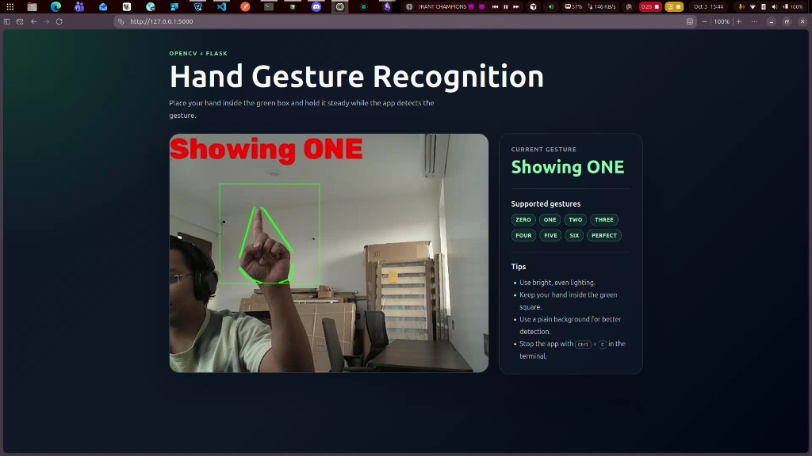
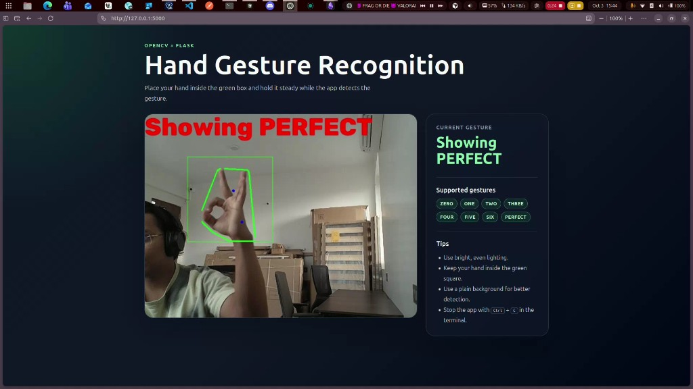
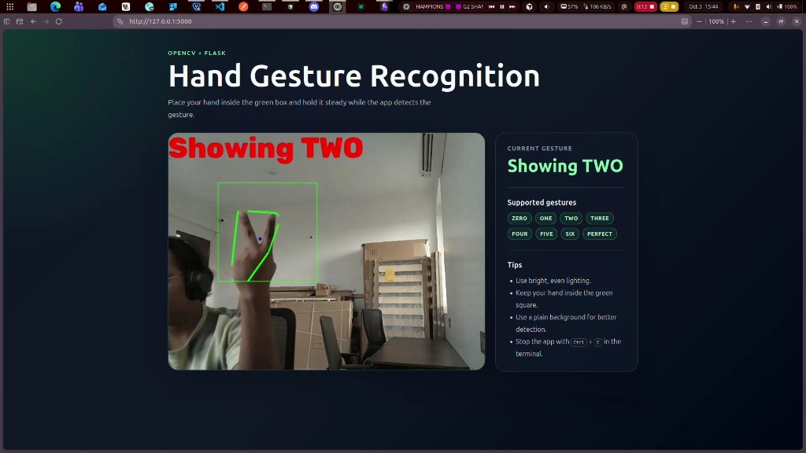
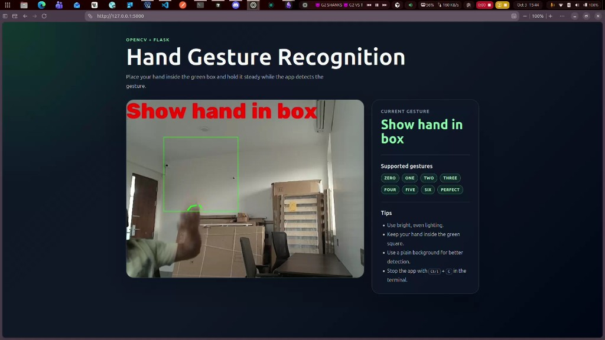

# Basic Hand Gesture Recognition

Real-time hand gesture recognition using Python, OpenCV, and a lightweight Flask web interface.

The original OpenCV gesture recognition logic is preserved in `hand.py`. The web app wraps the same frame-processing approach with a browser-based UI that streams the webcam feed and displays the detected gesture.

## Preview

<p align="center">
  
  
</p>

<p align="center">
  
  
</p>

## Features

- Live webcam feed in the browser.
- Real-time gesture label beside the video stream.
- Preserves the original contour, convex hull, and convexity defect logic.
- Supports the gestures from the original project: `ZERO`, `ONE`, `TWO`, `THREE`, `FOUR`, `FIVE`, `SIX`, and `PERFECT`.
- Includes the original OpenCV window mode through `hand.py`.

## Tech Stack

- Python
- OpenCV
- NumPy
- Flask
- HTML and CSS

## Project Structure

```text
.
├── app.py                     # Flask backend and webcam stream routes
├── gesture_recognition.py     # Frame-processing adapter for the web UI
├── hand.py                    # Original OpenCV script
├── requirements.txt           # Python dependencies
├── templates/
│   └── index.html             # Web UI markup
├── static/
│   └── style.css              # Web UI styles
├── docs/
│   └── screenshots/           # README screenshots
└── README.md
```

## Setup

Create a virtual environment and install the dependencies:

```bash
python3 -m venv .venv
source .venv/bin/activate
python -m pip install --upgrade pip
python -m pip install -r requirements.txt
```

## Run The Web App

Start the Flask server:

```bash
python app.py
```

Open the app in your browser:

[http://127.0.0.1:5000](http://127.0.0.1:5000)

Place your hand inside the green square. The detected gesture appears both on the video feed and in the status panel.

To stop the server, press `Ctrl + C` in the terminal.

## Run The Original OpenCV Script

The original script is still available:

```bash
python hand.py
```

Press `s` while the OpenCV window is focused to stop the desktop version.

## Usage Tips

- Use bright, even lighting.
- Keep your hand inside the green square.
- Use a plain background for better contour detection.
- Move your hand slowly and hold the gesture steady for a moment.

## Linux Webcam Notes

Check that your webcam is detected:

```bash
ls /dev/video*
```

If you see a permission error, add your user to the `video` group and then log out and back in:

```bash
sudo usermod -aG video $USER
```

If OpenCV reports missing system libraries, install:

```bash
sudo apt update
sudo apt install libgl1 libglib2.0-0
```

## Notes

This is a classical computer vision project. Detection quality depends heavily on lighting, background, camera angle, and how clearly the hand appears inside the region of interest.
